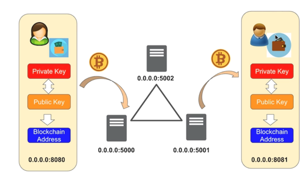

# blockchain-go


コンセンサスアルゴリズムをつかってブロックの正当性を証明する。


## 利用方法


以下の通りblockchainバックエンドを3つ起動します

```bash
cd blockchain_server
go run main.go
go run main.go -port=15001
go run main.go -port=15002
```

フロントエンドサーバーも2つ立ち上げます

```bash
cd wallet_server
go run main.go
go run main.go -port 8081 -gateway http://127.0.0.1:15001
```

blockchainサーバー(15000)の起動時に出力される3つの値をコピーし、

```plaintext
Blockchain: 2024/12/13 06:54:05 private_key ea54edb9888ac62545ddfcf78d46b85207c4080f849f0a3ea8fad7a9e3055e99
Blockchain: 2024/12/13 06:54:05 public_key a34088bab20a5ca2d4ebc6a973576fa7236c05f771e9841062f2af227a65f179517447059b078eb1b632b7cd114e79fbdff4f1fcea99781ede2084e9a8654c2b
Blockchain: 2024/12/13 06:54:05 blockchain_address 1KTNPvTuyC3wU6bH3bv29W9cKW782t52Nk
```

* これをユーザ1用のフロントエンド画面である http://localhost:8080 にアクセスして、それぞれを登録します

* 次にユーザ2用のフロントエンド画面 http://localhost:8081 にアクセスして、表示された Blockchain Addressをコピーします。
* 再度ユーザ1用の画面に戻り、ユーザ2のBlockchain Addressを送金先として送金します。
* 送金する際、ユーザ1のwalletが初期だと0ですが、時間が経つごとに数字が増えていくので(マイニングしているエミュレーション)、その分だけ送金できます。

ユーザ2の画面をみてみると、ユーザ1から送金された金額分、walletに追加されている事がわかります